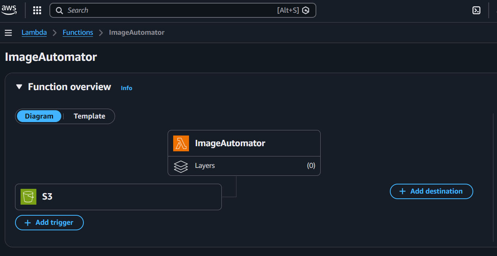
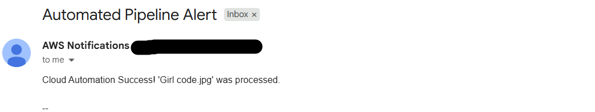

<div align="center">

# ⚡ Serverless Event-Driven Image Pipeline
### Automated Image Processing on AWS
### *Upload it. Process it. Get notified. Zero servers.* ☁️

[]()
[]()
[]()
[]()
[]()

</div>

---

## ⚡ What is this?

> *You upload an image. The cloud does everything else.*

A **fully serverless, event-driven image processing pipeline** built on AWS. When a file is uploaded to S3, Lambda automatically triggers, processes the file in real time, and SNS sends an automated email notification — with **zero server management**.

---

## 🏗️ Architecture

```
User uploads image
       ↓
Amazon S3 (Object Created Event)
       ↓
AWS Lambda — ImageAutomator
(Processes file in real time)
       ↓
Amazon SNS
       ↓
✅ "Cloud Automation Success! 'filename' was processed."
```

---

## 🖥️ Live Proof — It Actually Works!

### ⚡ AWS Lambda — ImageAutomator Function


> The **ImageAutomator** Lambda function with S3 as trigger — fires automatically on every file upload. No manual intervention needed. ✅

---

### 📧 Real SNS Email Notification


> Actual AWS SNS email received: **"Cloud Automation Success! 'Girl code.jpg' was processed."** 💜
> Full pipeline confirmed working — upload → process → notify.

---

## ☁️ Tech Stack

| Service | Role |
|---|---|
| 🪣 **Amazon S3** | Stores images + triggers pipeline on upload |
| ⚡ **AWS Lambda** | Serverless compute — ImageAutomator function |
| 📧 **Amazon SNS** | Automated email notifications |
| 🔐 **AWS IAM** | Secure roles between services |
| 🐍 **Python** | Lambda function runtime |

---

## ✨ Key Features

- 🚀 **Fully event-driven** — S3 Object Created event triggers everything
- ⚡ **Real-time processing** — Lambda fires instantly on upload
- 📧 **Automated notifications** — SNS emails on every successful process
- 🔧 **Zero server management** — no EC2, no maintenance
- 💰 **Cost efficient** — pay only when pipeline runs
- 🔐 **Secure** — IAM roles control all access

---

## 🚀 How It Works

```
Step 1 → Upload image to S3 bucket
Step 2 → S3 Object Created event fires
Step 3 → Lambda (ImageAutomator) triggered automatically
Step 4 → File processed in real time
Step 5 → SNS publishes notification
Step 6 → Email received ✅
```

---

## 💡 What I Learned

- Building a **serverless pipeline** from scratch on AWS
- Configuring **S3 event triggers** to invoke Lambda
- Writing **Lambda functions in Python**
- Setting up **Amazon SNS** for automated notifications
- Managing **IAM roles** to connect S3 → Lambda → SNS
- Understanding **event-driven architecture** used in production

---

## 👩‍💻 Built By

<div align="center">

**Yashvi Thakar** — Cloud & DevOps Engineer

[](https://www.linkedin.com/in/yashvithakar/)
[](https://github.com/yashvi-create)

*Build. Automate. Repeat.* ☁️✨

</div>
